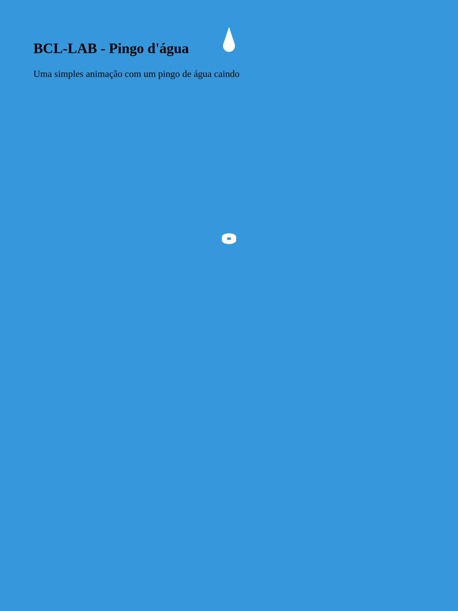

# Drip Drop Animation || Pingo de água caindo

Uma simples animação de um pingo de água caindo

Autor: Brenno




#### Tecnologias usadas:
- [HTML](https://www.w3schools.com/html/default.asp)
- [CSS](https://developer.mozilla.org/pt-BR/docs/Web/CSS)


#### Como criar gif animada com imagens das telas de suas aplicações.

- No linux abra o termina e digite o comando abaixo:
```bach
convert -delay 120 -loop 0 *.png criandoGIFcomImagens_by_Brenno_BCL-LAB.gif
```

### Onde me encontrar

- [BCL-LAB](https://www.youtube.com/channel/UCr2gZzk_SAA53JzfRw7BL7g)
- [BCL-ST](https://www.bcl-st.com.br)